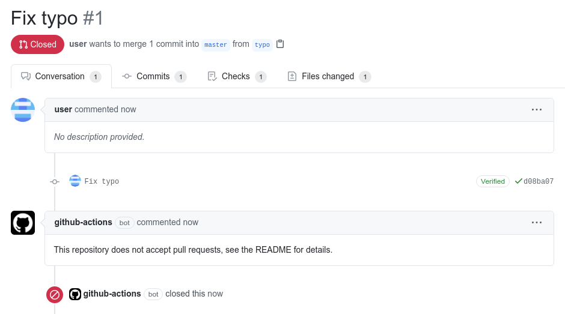

# Repo Lockdown

[](https://travis-ci.com/dessant/repo-lockdown)
[](https://www.npmjs.com/package/repo-lockdown)

Repo Lockdown is a GitHub App built with [Probot](https://github.com/probot/probot)
that closes and locks new and existing issues or pull requests.
It is used for repositories which do not accept issues or pull requests,
such as forks or mirrors.



## Supporting the Project

The continued development of Repo Lockdown is made possible
thanks to the support of awesome backers. If you'd like to join them,
please consider contributing with [Patreon](https://www.patreon.com/dessant),
[PayPal](https://www.paypal.me/ArminSebastian) or [Bitcoin](https://goo.gl/uJUAaU).

## Usage

1. **[Install the GitHub App](https://github.com/apps/repo-lockdown)**
   for the intended repositories
2. Create `.github/lockdown.yml` based on the template below
3. New issues and/or pull requests will be handled as they are opened,
   while existing ones will begin to be processed within an hour

⚠️ **If possible, install the app only for select repositories.
Do not leave the `All repositories` option selected, unless you intend
to use the app for all current and future repositories.**

#### Configuration

Create `.github/lockdown.yml` in the default branch to enable the app,
or add it at the same file path to a repository named `.github`.
The file can be empty, or it can override any of these default settings:

```yaml
# Configuration for Repo Lockdown - https://github.com/dessant/repo-lockdown

# Skip issues and pull requests created before a given timestamp. Timestamp must
# follow ISO 8601 (`YYYY-MM-DD`). Set to `false` to disable
skipCreatedBefore: false

# Issues and pull requests with these labels will be ignored. Set to `[]` to disable
exemptLabels: []

# Comment to post before closing or locking. Set to `false` to disable
comment: false

# Label to add before closing or locking. Set to `false` to disable
label: false

# Close issues and pull requests
close: true

# Lock issues and pull requests
lock: true

# Limit to only `issues` or `pulls`
# only: issues

# Optionally, specify configuration settings just for `issues` or `pulls`
# issues:
#   label: wontfix

# pulls:
#   comment: >
#     This repository does not accept pull requests, see the README for details.
#   lock: false

# Repository to extend settings from
# _extends: repo
```

## Why are only some issues and pull requests processed?

To avoid triggering abuse prevention mechanisms on GitHub, only 30 issues
and pull requests will be handled per hour. If your repository has more
than that, it will just take a few hours or days to process them all.

## Deployment

See [docs/deploy.md](docs/deploy.md) if you would like to run your own
instance of this app.

## License

Copyright (c) 2019 Armin Sebastian

This software is released under the terms of the MIT License.
See the [LICENSE](LICENSE) file for further information.
